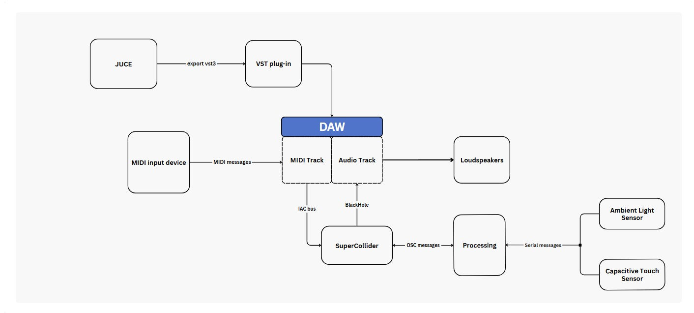
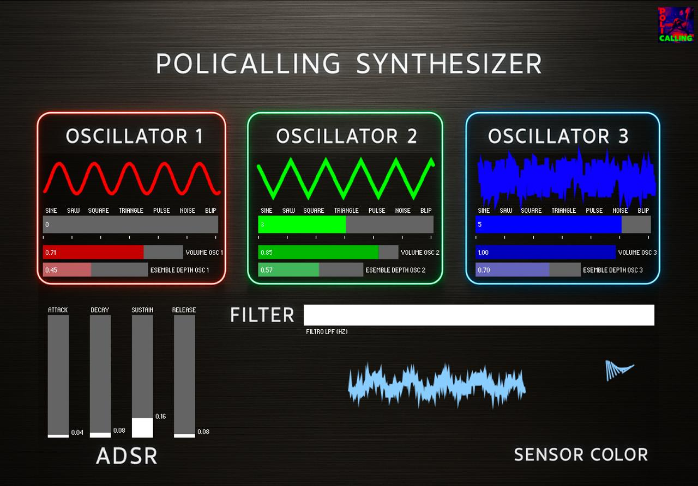
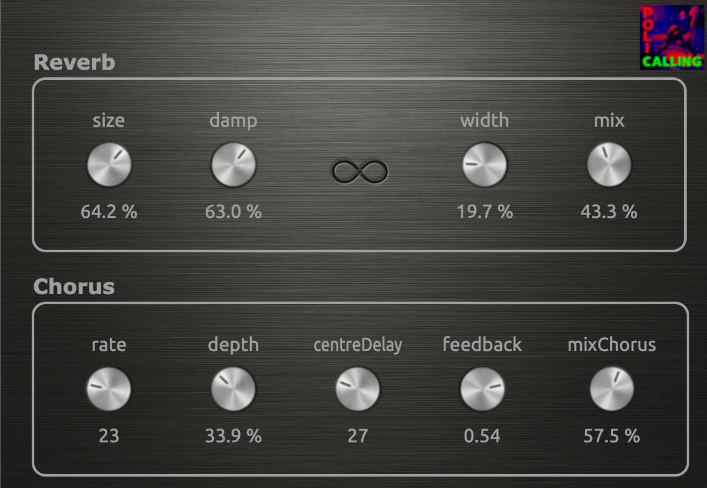
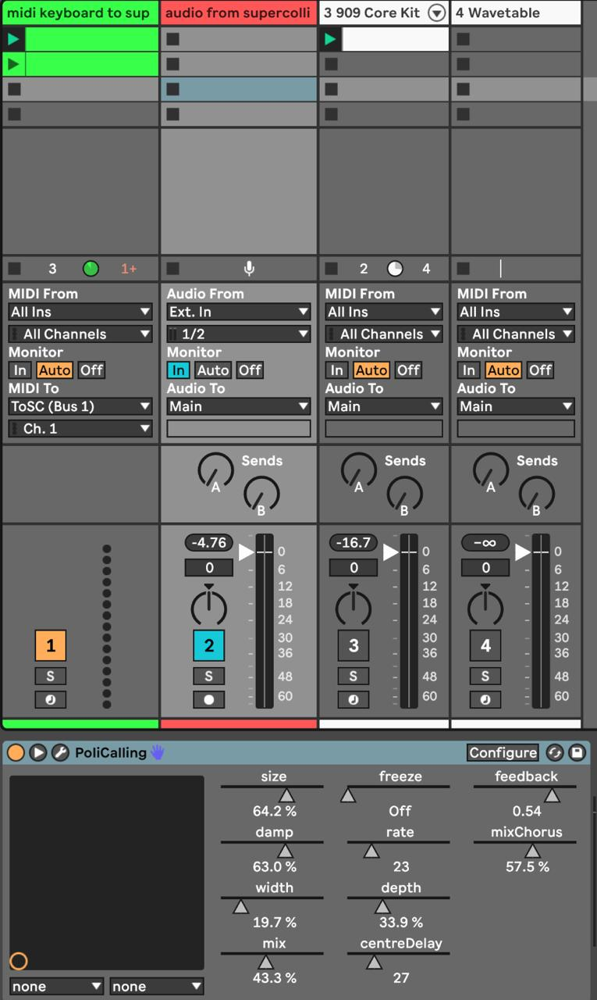
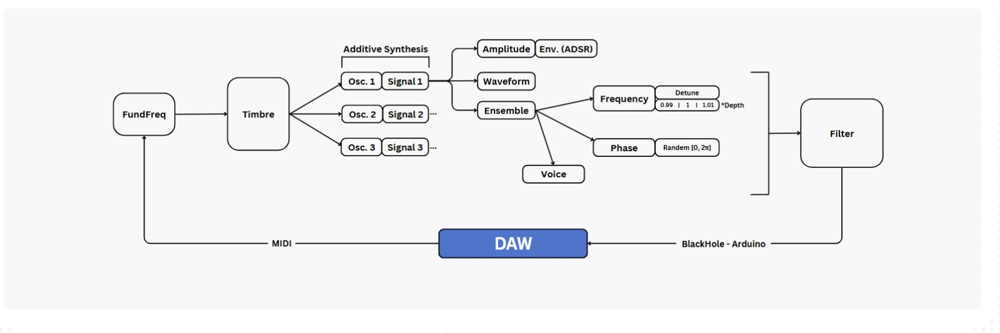

# POLICalling

## 🎯 Introduction

The POLICalling project is an advanced synthesizer system designed for real-time audiovisual performance and DAW integration. It connects physical input (color and touch) with digital synthesis and VST effects, offering a dynamic and modular interface for sound design.

---

## 🧰 System Architecture


<p align="center">
  
</p>

A complete data flow: Arduino → Processing → SuperCollider → DAW + JUCE Plugin.  
OSC and MIDI channels bridge the analog and digital parts, while BlackHole and IAC provide routing.

---

## 🎛 Synth Module

### a. 🖥️ Graphical User Interface (GUI)

<p align="center">
  
</p>

Each oscillator features waveform selection, volume, and ensemble detune.  
The combined waveform viewer is colored dynamically via the sensor.

### b. 🎛️ MIDI & OSC Control

- `noteOn` / `noteOff` from DAW via IAC
- OSC messages from Processing control:
  - `/wave [i1, i2, i3]`
  - `/volumes [v1, v2, v3]`
  - `/ensemble [e1, e2, e3]`
  - `/adsr [a, d, s, r]`
  - `/filter` (cutoff in Hz)

### c. 🛠️ Key SuperCollider Components

```supercollider
SynthDef, EnvGen, Select, Splay
RLPF, LPF, RHPF, HPF (cascade!)
```

---

## 🎚 Audio Plugin Module (JUCE)

### a. Interface and Effects

<p align="center">
  
</p>

- **Reverb**: size, damp, width, mix, freeze  
- **Chorus**: rate, depth, centreDelay, feedback, mix  
- Implemented with `juce::Reverb`, `juce::dsp::Chorus`

### b. Host DAW Integration

<p align="center">
  
</p>

- MIDI from controller to SuperCollider  
- Audio from SuperCollider to Ableton audio track  
- VST plugin processed inside Ableton

---

## 🎮 Interactive Module

### Processing + Arduino + OSC

<p align="center">
  
</p>

Waveform, ADSR and Ensemble are adjusted based on sensor input.  
Arduino detects touch and ambient light.  
Processing maps these values and sends them via OSC.

### UI and Color Mapping

- Real-time waveform animation (3 voices)
- Background and waveform color reflect RGB from light sensor  
- GUI includes waveform selector, ADSR sliders, ensemble and filter

---

## 🧪 Summary of Libraries

| Component        | Technology         |
|------------------|--------------------|
| Synth Engine     | SuperCollider      |
| OSC Interface    | Processing + oscP5 |
| Sensor Input     | Arduino + Serial   |
| Audio FX Plugin  | JUCE               |
| Host Integration | Ableton Live       |
